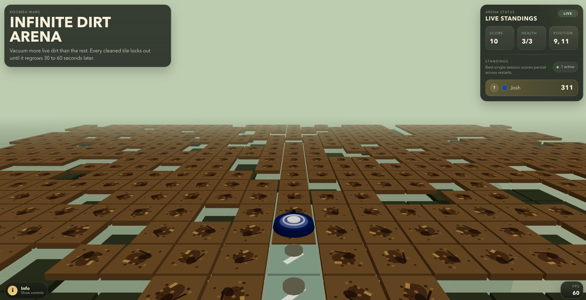

# Roomba Wars

Roomba Wars is an infinite-grid multiplayer browser game built on Cloudflare Workers and Durable Objects. Players join with a name and custom roomba color, vacuum dirt on a shared procedural arena, avoid blocked tiles, and compete for the best single-session score on the persistent leaderboard.

## What The App Does

- Runs one shared multiplayer world with a single authoritative Durable Object.
- Spawns players across an infinite procedural dirt field instead of a fixed map.
- Allows movement only onto live dirt tiles.
- Scores a tile when a roomba successfully leaves it.
- Regrows cleaned dirt on a random 30 to 60 second timer.
- Includes dust bunny enemies that attack nearby players and trigger auto-counterattacks.
- Persists leaderboard best scores across restarts while each fresh play session starts at `0`.
- Supports a local benchmark mode for renderer and simulation load testing without the multiplayer server.

## Stack

- React 19 + Vite for the browser client
- `@react-three/fiber` + `three` for the 3D arena rendering
- Cloudflare Worker + Durable Objects for the authoritative game state
- Vitest for simulation coverage

## Gameplay Rules

- A roomba can only move onto tiles that currently contain dirt.
- Dirt is collected when the roomba leaves a tile, not when it enters.
- Cleaned tiles become blocked while regrowing.
- Active player names must be unique, case-insensitively.
- Only one roomba can occupy a tile at a time.
- Dust bunnies move under server authority and can damage nearby players.

## Controls

### Match

- `W` / `Up`: move forward
- `S` / `Down`: move backward
- `A` / `Left`: rotate left in place
- `D` / `Right`: rotate right in place
- Mobile: swipe to move or turn

### Benchmark

- Mouse drag: look
- `WASD`: move camera
- `Ctrl` / `Q`: lower camera
- `Space` / `E`: raise camera
- Mouse wheel: dolly forward/back
- `Shift`: move faster

## Benchmark Mode

Open the client with `?benchmark=1&bots=100` to launch a local benchmark scene without the multiplayer server.

Benchmark mode:

- runs the real `GameWorld` simulation locally
- uses the same dirt, collision, regrow, and enemy rules as the live game
- shortens dirt regrow to `5s` so benchmark traffic keeps circulating
- streams the infinite field around the free camera view
- includes a live simulation speed slider that persists in browser storage
- can constrain dense test crowds into a spaced square layout with varied bot colors
- renders benchmark roombas with one consistent high-visibility model so dense crowds are easier to inspect

Optional params:

- `bots`: number of benchmark roombas, clamped to `1-400`
- `field`: extra tile padding around the camera span, clamped to `12-40`
- `speed`: initial simulation speed, clamped to `0-4`; the slider value is then remembered locally for later benchmark runs
- `square=1`: constrain benchmark roombas to one centered square while spacing their starting slots 10 cells apart and assigning varied colors
- `bunnies=1`: enable dust bunny simulation

Example:

`http://localhost:5173/?benchmark=1&bots=200&field=24&speed=1.5&square=1&bunnies=1`

## Local Development

1. Install dependencies with `npm install`.
2. Run `npm run dev:worker` to start the Worker and Durable Object on `127.0.0.1:8787`.
3. In another terminal, run `npm run dev`.
4. Open the Vite URL. `/api` and WebSocket traffic are proxied to the local Worker automatically.

## Scripts

- `npm run dev`: start the Vite client
- `npm run dev:worker`: start the Worker and Durable Object locally
- `npm run test`: run simulation tests
- `npm run lint`: run ESLint
- `npm run build`: typecheck and build the production client
- `npm run deploy`: build and deploy through Wrangler

## Project Layout

- [`/Users/nearby/Sites/roomba-wars/server/worker.ts`](/Users/nearby/Sites/roomba-wars/server/worker.ts): Worker entrypoint, join API, WebSocket routing, Durable Object wrapper
- [`/Users/nearby/Sites/roomba-wars/server/game-world.ts`](/Users/nearby/Sites/roomba-wars/server/game-world.ts): Core world simulation, spawning, movement, regrowth, enemies, and leaderboard behavior
- [`/Users/nearby/Sites/roomba-wars/shared/protocol.ts`](/Users/nearby/Sites/roomba-wars/shared/protocol.ts): Shared protocol constants, message types, and helpers
- [`/Users/nearby/Sites/roomba-wars/src/game/WorldScene.tsx`](/Users/nearby/Sites/roomba-wars/src/game/WorldScene.tsx): 3D scene, camera logic, batched tile rendering, and actor rendering
- [`/Users/nearby/Sites/roomba-wars/src/game/useRoombaWars.ts`](/Users/nearby/Sites/roomba-wars/src/game/useRoombaWars.ts): live client networking, input handling, and multiplayer state
- [`/Users/nearby/Sites/roomba-wars/src/benchmark/useBenchmarkArena.ts`](/Users/nearby/Sites/roomba-wars/src/benchmark/useBenchmarkArena.ts): local benchmark simulation loop and bot logic
- [`/Users/nearby/Sites/roomba-wars/src/components/`](/Users/nearby/Sites/roomba-wars/src/components): HUD and benchmark UI components

## Deployment Notes

- Wrangler config lives in [`/Users/nearby/Sites/roomba-wars/wrangler.jsonc`](/Users/nearby/Sites/roomba-wars/wrangler.jsonc).
- The production client bundle is emitted to `dist/client`.
- The Durable Object class is `WorldDurableObject` and is bound as `WORLD`.
